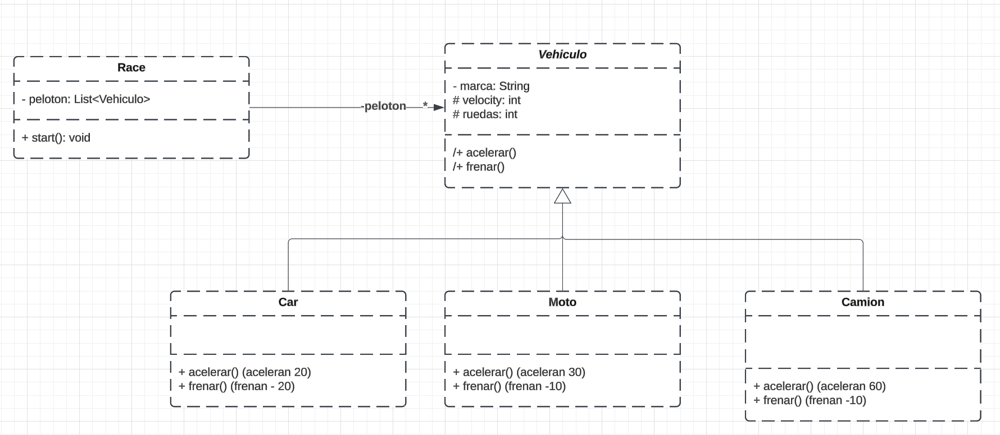

# 🚀Pistoletazo de salida

## Descripción
Pistoletazo de salida para una carrera de vehículos (**Kata Java: Race (Herencia y Polimorfismo**)

## Introducción
- **¿Qué es?** Es una simulación del inicio de una carrera de vehículos.
- **Características principales:** En la carrera participan varios tipos de vehículos como por ejemplo un coche, una moto y un camión, cada vehículo arranca a una velocidad específica que en nuestro caso es diferente según el tipo de vehículo.

## Tecnologías utilizadas
| **JAVA** |
|:--------:|
| **OOP**  |

## UML Class Diagram

## Despliegue
https://github.com/monicasimoF5/IntroJava/tree/main/src/main/java/org/msc/vehicle

## Contacto
|**Mònica Simó**|
|:-:|
 

